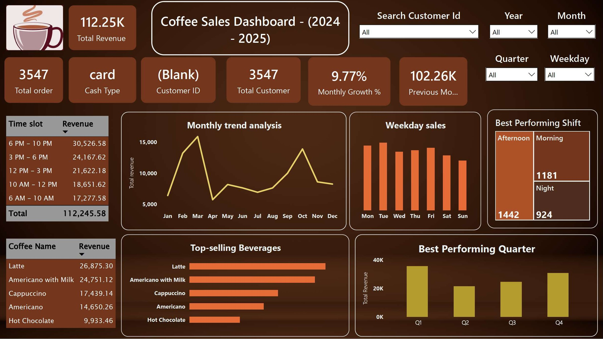

#  Coffee Sales Power BI Dashboard

## Project Overview
This project presents an interactive Power BI dashboard designed to analyze coffee shop sales performance. The dashboard provides insights into revenue trends, customer behavior, product performance, and operational efficiency, enabling data-driven decision-making.

##  Objectives
- Monitor overall business performance.
- Analyze month-over-month (MoM) revenue growth.
- Identify top-selling beverages.
- Determine the best-performing sales shift.
- Understand customer purchasing behavior.

##  Key Features
- **KPIs:** Total Revenue, Total Orders, Monthly Growth %.
- **Time Intelligence:** Monthly and quarterly revenue trends with Previous Month comparison.
- **Product Analysis:** Top and bottom-performing beverages.
- **Shift Analysis:** Identification of peak sales periods (Morning, Afternoon, Night).
- **Customer Insights:** Searchable customer ID analysis.
- **Interactive Filters:** Slicers for Date, Shift, Beverage, and Customer.

##  Tools & Technologies
- **Power BI**
- **DAX (Data Analysis Expressions)**
- **Power Query**
- **SQL**
- **Excel**

  ##  Dashboard Preview

##  Author
**Subhradip**  
Aspiring Data Analyst 
